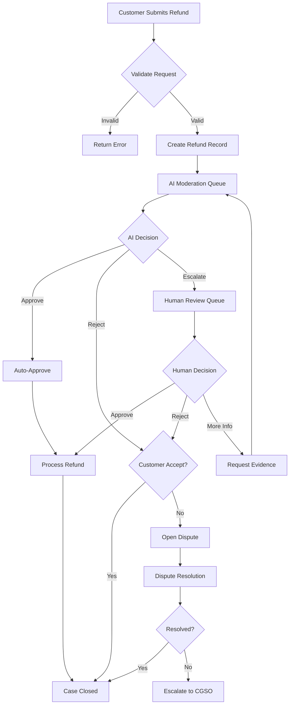
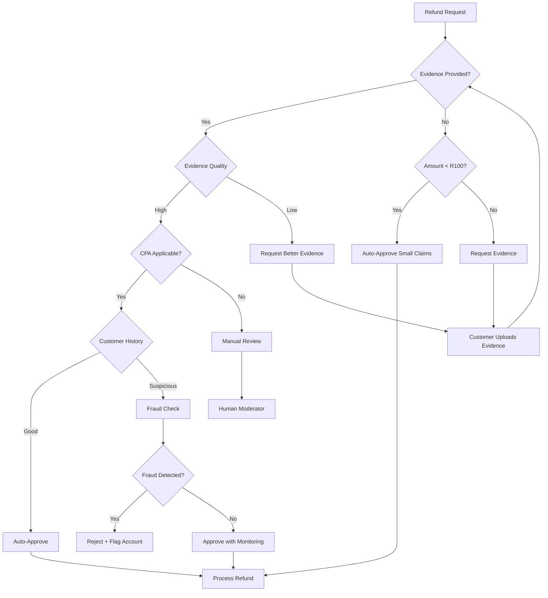

# iHhashi Refund & Dispute System

> Comprehensive refund policy and AI moderation system compliant with South African Consumer Protection Act (CPA) 68 of 2008 and Electronic Communications and Transactions Act (ECTA) 25 of 2002

---

## Table of Contents

1. [Overview](#overview)
2. [Database Schema](#database-schema)
3. [API Endpoints](#api-endpoints)
4. [AI Moderator Implementation](#ai-moderator-implementation)
5. [SA Consumer Law Compliance](#sa-consumer-law-compliance)
6. [Workflow Diagrams](#workflow-diagrams)

---

## Overview

### Problem Statement

Traditional refund processes are slow, frustrating, and costly:
- Customers wait days for resolution
- Merchants lose time on minor disputes
- No clear legal framework compliance
- Inconsistent decisions

### Solution

AI-powered moderation with SA Consumer Protection Act compliance:
- **Instant decisions** for clear-cut cases
- **Consistent application** of consumer law
- **Fast resolution** - target under 2 hours
- **Fair outcomes** for both customers and merchants

---

## Database Schema

### Collections

```
refunds/
├── id: ObjectId
├── order_id: string
├── customer_id: string
├── merchant_id: string
├── delivery_id: string?
├── refund_items: RefundItem[]
│   ├── order_item_id: string
│   ├── product_name: string
│   ├── quantity: int
│   ├── unit_price: float
│   ├── total_price: float
│   ├── refund_reason: enum
│   └── notes: string?
├── total_refund_amount: float
├── refund_reason: enum
├── customer_explanation: string
├── status: enum
├── evidence: Evidence[]
│   ├── evidence_id: string
│   ├── evidence_type: string
│   ├── file_url: string?
│   ├── description: string
│   ├── submitted_by: string
│   ├── submitted_at: datetime
│   ├── verified: bool
│   └── ai_confidence: float?
├── ai_decision: string?
├── ai_confidence: float?
├── ai_reasoning: string?
├── ai_flags: string[]
├── approved_amount: float?
├── refund_method: enum
├── resolution_notes: string?
├── resolved_by: string?
├── resolved_at: datetime?
├── created_at: datetime
├── deadline: datetime  # 10 business days
├── merchant_response: string?
├── merchant_response_at: datetime?
├── merchant_evidence: Evidence[]
├── escalation_reason: string?
├── escalated_to: string?
├── escalated_at: datetime?
├── cpa_section_applicable: string?
└── consumer_rights_exercised: string?

disputes/
├── id: ObjectId
├── refund_id: string?
├── order_id: string
├── customer_id: string
├── merchant_id: string?
├── rider_id: string?
├── dispute_type: enum
├── priority: enum
├── title: string
├── description: string
├── status: enum
├── ai_summary: string?
├── ai_recommendation: string?
├── ai_confidence: float?
├── similar_cases_found: int
├── created_at: datetime
├── updated_at: datetime
├── resolution_deadline: datetime
├── resolution: string?
├── resolution_type: string?
├── resolved_by: string?
├── resolved_at: datetime?
├── assigned_moderator: string?
├── communications: Message[]
├── external_reference: string?
├── external_status: string?
├── compensation_amount: float?
└── compensation_type: string?

moderation_decisions/
├── id: ObjectId
├── refund_id: string?
├── dispute_id: string?
├── action: enum
├── confidence: float
├── reasoning: string
├── evidence_analysis: object
├── policy_violations: string[]
├── risk_factors: string[]
├── similar_cases: string[]
├── cpa_sections_considered: string[]
├── consumer_rights_assessed: string[]
├── created_at: datetime
├── processing_time_ms: int?
├── human_override: bool
├── override_reason: string?
└── overridden_by: string?

moderation_policies/
├── id: ObjectId
├── name: string
├── description: string
├── policy_type: enum
├── rules: object[]
├── priority: int
├── active: bool
├── created_at: datetime
├── updated_at: datetime
├── cpa_reference: string?
└── ecta_reference: string?
```

### Indexes

```javascript
// Refunds
db.refunds.createIndex({ "customer_id": 1, "status": 1 })
db.refunds.createIndex({ "merchant_id": 1, "status": 1 })
db.refunds.createIndex({ "status": 1, "deadline": 1 })
db.refunds.createIndex({ "created_at": -1 })

// Disputes
db.disputes.createIndex({ "customer_id": 1 })
db.disputes.createIndex({ "merchant_id": 1 })
db.disputes.createIndex({ "status": 1, "priority": 1 })
db.disputes.createIndex({ "resolution_deadline": 1 })

// Moderation Decisions
db.moderation_decisions.createIndex({ "refund_id": 1 })
db.moderation_decisions.createIndex({ "created_at": -1 })
```

---

## API Endpoints

### Customer Endpoints

| Method | Endpoint | Description |
|--------|----------|-------------|
| POST | `/refunds/request` | Submit refund request |
| GET | `/refunds/my-requests` | List customer's refunds |
| GET | `/refunds/{id}` | Get refund details |
| POST | `/refunds/{id}/evidence` | Add evidence |
| POST | `/refunds/{id}/dispute` | Open dispute |

### Merchant Endpoints

| Method | Endpoint | Description |
|--------|----------|-------------|
| GET | `/refunds/merchant/pending` | Get pending refunds |
| POST | `/refunds/{id}/merchant-response` | Respond to refund |
| POST | `/refunds/{id}/evidence` | Add merchant evidence |

### Admin/Moderator Endpoints

| Method | Endpoint | Description |
|--------|----------|-------------|
| GET | `/refunds/admin/all` | List all refunds |
| GET | `/refunds/admin/stats` | Get statistics |
| POST | `/refunds/{id}/resolve` | Resolve refund |
| POST | `/refunds/{id}/escalate` | Escalate to human |
| GET | `/disputes/admin/queue` | Get dispute queue |
| POST | `/disputes/{id}/resolve` | Resolve dispute |
| GET | `/refunds/{id}/ai-review` | Get AI analysis |

### Webhook Endpoints

| Method | Endpoint | Description |
|--------|----------|-------------|
| POST | `/webhooks/cgso` | CGSO external escalation webhook |
| POST | `/webhooks/payment-refund` | Payment provider refund callback |

---

## AI Moderator Implementation

### Architecture Overview

```
┌─────────────────────────────────────────────────────────────┐
│                    REFUND REQUEST FLOW                       │
├─────────────────────────────────────────────────────────────┤
│                                                              │
│  Customer ──► Submit Request ──► Validate (CPA) ──► Queue   │
│                                                              │
│                              │                               │
│                              ▼                               │
│                    ┌─────────────────┐                       │
│                    │   AI MODERATOR  │                       │
│                    │   ┌─────────┐   │                       │
│                    │   │  NLP    │   │                       │
│                    │   │ Engine  │   │                       │
│                    │   └────┬────┘   │                       │
│                    │        │        │                       │
│                    │   ┌────▼────┐   │                       │
│                    │   │ Policy  │   │                       │
│                    │   │ Engine  │   │                       │
│                    │   └────┬────┘   │                       │
│                    │        │        │                       │
│                    │   ┌────▼────┐   │                       │
│                    │   │Decision │   │                       │
│                    │   │ Engine  │   │                       │
│                    │   └────┬────┘   │                       │
│                    └────────┼────────┘                       │
│                             │                                │
│              ┌──────────────┼──────────────┐                 │
│              │              │              │                 │
│              ▼              ▼              ▼                 │
│         APPROVE        ESCALATE       REJECT                │
│         (auto)         (human)        (with reason)         │
│                                                              │
└─────────────────────────────────────────────────────────────┘
```

### AI Decision Pipeline

```python
class AIModerator:
    """AI-powered refund moderation system"""
    
    def __init__(self):
        self.nlp_engine = NLPEngine()
        self.policy_engine = PolicyEngine()
        self.decision_engine = DecisionEngine()
        self.confidence_threshold = 0.85
    
    async def moderate(self, refund: Refund) -> ModerationDecision:
        """Main moderation pipeline"""
        
        # Step 1: NLP Analysis
        analysis = await self.nlp_engine.analyze(
            customer_explanation=refund.customer_explanation,
            evidence=refund.evidence,
            order_context=refund.order
        )
        
        # Step 2: Policy Check
        policy_result = await self.policy_engine.evaluate(
            refund=refund,
            analysis=analysis,
            cpa_rules=CPA_RULES
        )
        
        # Step 3: Risk Assessment
        risk_score = await self.assess_risk(
            refund=refund,
            customer_history=refund.customer.refund_history,
            merchant_reliability=refund.merchant.reliability_score
        )
        
        # Step 4: Decision
        decision = await self.decision_engine.decide(
            analysis=analysis,
            policy_result=policy_result,
            risk_score=risk_score,
            similar_cases=await self.find_similar_cases(refund)
        )
        
        return decision
```

### Decision Factors

| Factor | Weight | Description |
|--------|--------|-------------|
| **CPA Compliance** | 30% | Does the request fall under CPA protections? |
| **Evidence Quality** | 20% | Quality and quantity of evidence provided |
| **Customer History** | 15% | Past refund requests, approval rate |
| **Merchant Reliability** | 15% | Merchant's track record with refunds |
| **Case Similarity** | 10% | Outcomes of similar past cases |
| **Amount Threshold** | 5% | Higher amounts may need human review |
| **Time Since Order** | 5% | Within 10 business day window? |

### Auto-Approval Rules

```yaml
# Auto-approval conditions (CPA compliant)

auto_approve:
  - condition: "defective_goods + photo_evidence + customer_trust > 0.8"
    action: "approve_full"
    confidence_required: 0.85
    
  - condition: "wrong_item + merchant_acknowledged"
    action: "approve_full"
    confidence_required: 0.95
    
  - condition: "late_delivery + ecta_30_day_violation"
    action: "approve_full"
    confidence_required: 0.90
    
  - condition: "food_safety + photo_evidence"
    action: "approve_full"
    confidence_required: 0.90

auto_reject:
  - condition: "outside_10_business_days + no_exception"
    action: "reject"
    reason: "CPA time limit exceeded"
    
  - condition: "no_evidence + high_fraud_risk"
    action: "request_evidence"
    
  - condition: "customer_banned"
    action: "reject"
    reason: "Account suspended for policy violations"

escalate_to_human:
  - condition: "amount > R1000"
  - condition: "confidence < 0.70"
  - condition: "fraud_risk > 0.5"
  - condition: "merchant_disputed_with_evidence"
  - condition: "customer_requested_escalation"
```

### Chat-Based AI Moderator

The AI Moderator can be accessed via chat for real-time assistance:

```typescript
// Chat interface for AI moderator
interface ModeratorChat {
  // User messages
  sendMessage(refundId: string, message: string): Promise<ModeratorResponse>;
  
  // Get AI guidance
  getGuidance(refundId: string, question: string): Promise<Guidance>;
  
  // Request evidence analysis
  analyzeEvidence(refundId: string, evidenceUrl: string): Promise<Analysis>;
}

// Example conversation flow
const chat = new ModeratorChat();

// Customer asks about refund status
const response = await chat.sendMessage(
  "refund-123",
  "Why is my refund taking so long?"
);
// AI responds with status and timeline

// Merchant asks for guidance
const guidance = await chat.getGuidance(
  "refund-123",
  "What evidence do I need to dispute this?"
);
// AI provides CPA-compliant guidance
```

---

## SA Consumer Law Compliance

### Consumer Protection Act (CPA) 68 of 2008

| Section | Right | iHhashi Implementation |
|---------|-------|------------------------|
| **s20** | Right to return goods | 10 business day refund window |
| **s55** | Right to safe, good quality goods | Food safety checks, quality disputes |
| **s56** | Implied warranty of quality | 6-month warranty on goods |
| **s61** | Producer liability | Defect investigation, compensation |
| **s16** | Cooling-off period | 7-day cancellation for direct marketing |

### Electronic Communications and Transactions Act (ECTA) 25 of 2002

| Section | Right | iHhashi Implementation |
|---------|-------|------------------------|
| **s42** | Delivery within 30 days | Late delivery refunds |
| **s44** | 7-day cooling-off | Online order cancellation |
| **s43** | Price disclosure | Clear pricing display |

### Refund Timeline Requirements

```
Day 0:     Customer submits refund request
           └── AI instant analysis (under 5 seconds)
           
Day 0-1:   Merchant has 24 hours to respond
           └── Auto-approve if no response
           
Day 1-3:   Evidence collection phase
           └── AI continues analysis
           
Day 3-5:   Decision made
           └── Customer notified
           
Day 5-10:  Payment processing
           └── Refund to original payment method
           
Day 10:    CPA deadline
           └── Must be resolved by this date
```

### Escalation to CGSO

If a dispute cannot be resolved internally, customers can escalate to the Consumer Goods and Services Ombud (CGSO):

```python
async def escalate_to_cgso(dispute: Dispute):
    """Escalate unresolved dispute to CGSO"""
    
    # Check if internal process exhausted
    if dispute.internal_attempts < 3:
        raise Exception("Internal process not exhausted")
    
    # Check 20 business day window
    if datetime.utcnow() < dispute.resolution_deadline:
        raise Exception("Resolution deadline not reached")
    
    # Submit to CGSO
    cgso_reference = await cgso_api.submit_case({
        "consumer_name": dispute.customer.name,
        "consumer_contact": dispute.customer.contact,
        "supplier_name": dispute.merchant.name,
        "complaint_description": dispute.description,
        "previous_resolution_attempts": dispute.communications,
        "amount_in_dispute": dispute.refund.total_refund_amount,
        "cpa_sections_applicable": dispute.cpa_sections
    })
    
    # Update dispute
    dispute.external_reference = cgso_reference
    dispute.status = DisputeStatus.ESCALATED_EXTERNAL
    dispute.external_status = "submitted"
    
    return dispute
```

---

## Workflow Diagrams

### Refund Request Flow



### AI Moderation Decision Tree



---

## Implementation Checklist

- [x] Database schema designed
- [x] API endpoints specified
- [x] AI moderator architecture planned
- [ ] NLP engine integration
- [ ] Policy rule engine implementation
- [ ] Frontend refund form
- [ ] Merchant dashboard integration
- [ ] Payment gateway refund integration
- [ ] CGSO escalation API
- [ ] Testing with real scenarios

---

## Next Steps

1. **Implement AI Moderator Service** - Core decision engine
2. **Build Frontend Components** - Customer refund form, merchant response UI
3. **Integrate Payment Refunds** - Paystack refund API
4. **Add CGSO Integration** - External escalation workflow
5. **Launch Beta** - Test with limited merchants

---

*Document Version: 1.0.0*  
*Last Updated: 2026-02-27*  
*Compliance: SA CPA 68 of 2008, ECTA 25 of 2002*
